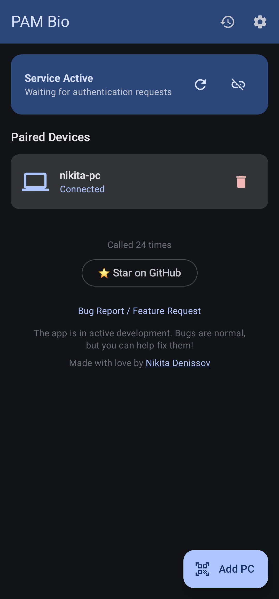
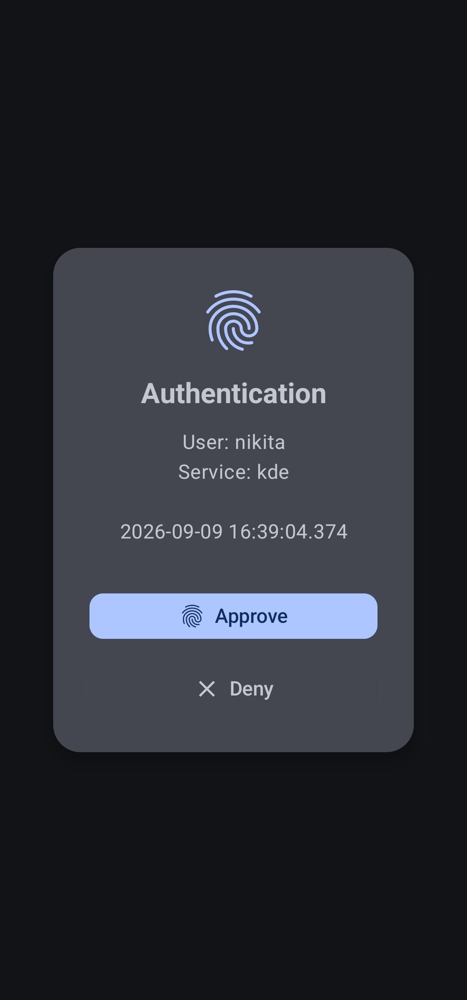
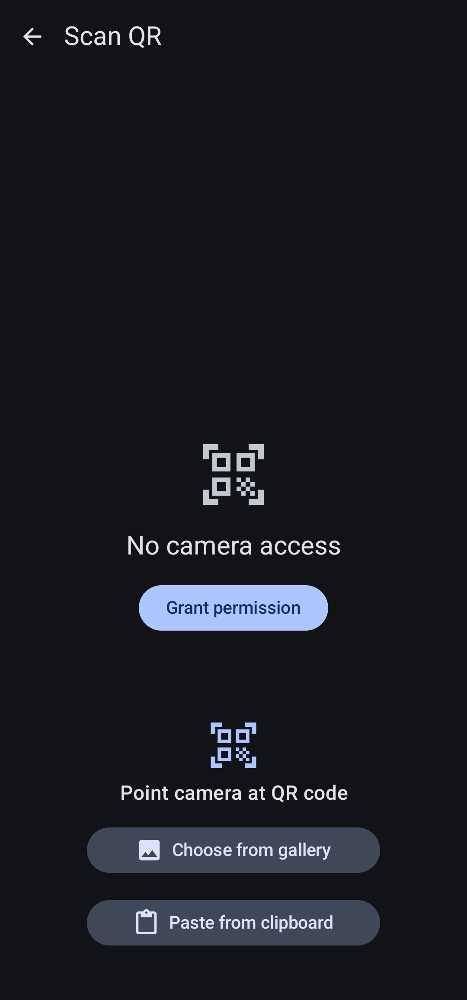
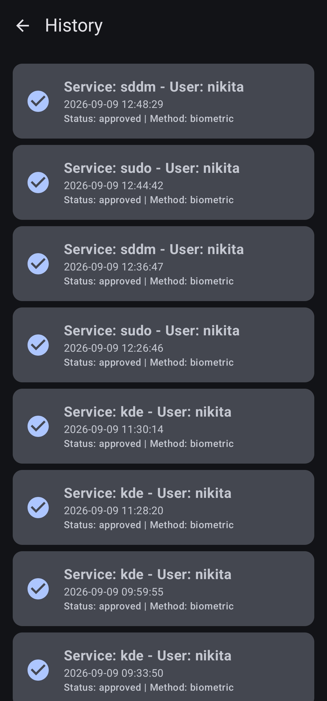
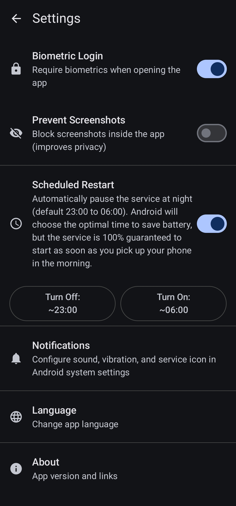

# PAM Bio

[](https://go.dev)
[](https://en.wikipedia.org/wiki/C_(programming_language))
[](https://developer.android.com/jetpack/compose)
[](https://appgallery.huawei.com/app/C118930945)
[](https://www.rustore.ru/catalog/app/ovh.dep.pam)
[](https://play.google.com/apps/testing/ovh.dep.pam)
[](https://copyright.kazpatent.kz/?!.iD=brCrZ)
[](LICENSE)
[](https://github.com/ndenissov/pam_bio/stargazers)

**PAM Bio** turns your Android smartphone into a biometric hardware security module for your Linux or Windows PC. Unlock your desktop, authenticate `sudo` requests, or bypass the Windows lock screen using your phone's fingerprint or face unlock—no YubiKey or extra hardware required.

If you've ever wanted to **log in to Windows or Linux with your phone fingerprint**, use your **Android phone as a Windows Hello alternative**, or treat your **Android device as a security key**, PAM Bio is exactly what you need.

<p align="center">
  
  
  
  
  
</p>

## Table of Contents
- [Why PAM Bio? (Features)](#why-pambio-features)
- [Architecture & Security](#architecture--security)
- [Download Android App](#download-android-app)
  - [Huawei AppGallery](#1-huawei-appgallery)
  - [RuStore](#2-rustore)
  - [Google Play (Closed Testing)](#3-google-play-closed-testing--testers-wanted-)
  - [F-Droid Repository](#4-official-pam-bio-f-droid-repository-github-pages)
  - [Direct APK Download](#5-direct-apk-download)
- [Installation & Setup](#installation--setup)
  - [NixOS (Recommended)](#1-nixos-recommended)
  - [Debian / Ubuntu (APT)](#2-debian--ubuntu-apt)
  - [Windows (Scoop)](#3-windows-scoop)
  - [Manual Installation](#4-manual-installation-other-linux-distributions)
- [Pairing Your Device](#pairing-your-device)
- [Managing Devices](#managing-devices)
- [Legal & Copyright](#legal--copyright)
- [Contributing](#contributing)
- [License](#license)

## Why PAM Bio? (Features)
- **Convenience:** Stop typing long passwords for `sudo` or lock screens. Use the biometric sensor already in your pocket.
- **Cost-Effective:** Achieve hardware-level 2FA security without buying an expensive security key.
- **Local Network Only:** No cloud servers, no accounts. Everything works over your local Wi-Fi.
- **Secure Cryptography:** Uses state-of-the-art X25519 ECDH, Ed25519, and AES-256-GCM to prevent interception and replay attacks.
- **Multilingual:** The Android app natively supports English, Russian (Русский), and Chinese (中文) interfaces.

## Architecture & Security

PAM Bio consists of three tightly integrated components:

*   **`daemon/` (Go):** The `pambiod` service. Runs on your PC, announces via mDNS, manages secure TCP connections with your phone, and listens for auth requests.
*   **`pam/` (C):** A lightweight PAM (Pluggable Authentication Module) written in pure C. It communicates with `pambiod` to intercept and fulfill auth requests (like `sudo`, `gdm`, or `sddm`).
*   **`android/` (Kotlin/Compose):** The Android application. Maintains an encrypted connection and displays full-screen biometric prompts when requested.
*   **`protocol/`**: Documentation of the JSON-based communication protocol.

### Security Guarantees
*   **Perfect Forward Secrecy:** Every connection begins with an X25519 ECDH key exchange.
*   **AES-256-GCM:** All communication is encrypted and authenticated.
*   **Ed25519 Identity:** The Android device signs a cryptographic nonce during every auth request to prove identity, preventing replay attacks.
*   **Minimal Attack Surface:** The PAM module (`pam_bio.so`) is written in pure C without external dependencies to guarantee stability in critical system auth paths.

---

## Download Android App

You can install the PAM Bio Android companion app using any of the following methods:

### 1. Huawei AppGallery

PAM Bio is officially published and available in **Huawei AppGallery**:

[](https://appgallery.huawei.com/app/C118930945)

* **Huawei AppGallery:** [https://appgallery.huawei.com/app/C118930945](https://appgallery.huawei.com/app/C118930945)

---

### 2. RuStore

PAM Bio is officially published and available in **RuStore**:

[](https://www.rustore.ru/catalog/app/ovh.dep.pam)

* **RuStore Catalog:** [https://www.rustore.ru/catalog/app/ovh.dep.pam](https://www.rustore.ru/catalog/app/ovh.dep.pam)

---

### 3. Google Play (Closed Testing — Testers Wanted! 🚀)

> [!IMPORTANT]
> **Help us launch on Google Play!**
> PAM Bio is currently in the mandatory closed testing period required by Google before public store listing. If you have an Android device, we warmly invite you to join our closed testing program! The more active testers join, the faster PAM Bio will complete Google's verification and become publicly available to everyone on Google Play.

**How to join in 3 steps:**
1. **Join the Google Group:** Open [https://groups.google.com/g/pam-bio](https://groups.google.com/g/pam-bio) and click **Join group** (required by Google to grant your account access to the closed test).
2. **Accept the invite on Google Play:** Open the opt-in link at [https://play.google.com/apps/testing/ovh.dep.pam](https://play.google.com/apps/testing/ovh.dep.pam) and click **Become a Tester**.
3. **Install from Play Market:** Once accepted, you can download and update the app directly through Google Play.

*(Для пользователей Android открыт свободный набор на закрытое тестирование: вступите в Google-группу [pam-bio](https://groups.google.com/g/pam-bio), перейдите по [ссылке тестирования](https://play.google.com/apps/testing/ovh.dep.pam) и примите приглашение. После этого приложение и его обновления будут доступны вам в Play Market! Чем быстрее наберутся тестировщики, тем скорее этот этап завершится и приложение будет опубликовано для всех.)*

---

### 4. Official PAM Bio F-Droid Repository (GitHub Pages)

You can add our self-hosted **F-Droid Repository** directly to your F-Droid client (or alternative clients like Neo Store or Droid-ify) for instant updates directly from our release pipeline:

* **Repository URL:** `https://ndenissov.github.io/pam_bio/fdroid/repo`

#### How to add in F-Droid:
1. Open the **F-Droid** app on your Android device.
2. Go to **Settings** $\rightarrow$ **Repositories** (or My Apps $\rightarrow$ Repositories).
3. Tap the **+** (Add Repository) button in the top right.
4. Enter the Repository Address: `https://ndenissov.github.io/pam_bio/fdroid/repo`
5. Tap **Add**. F-Droid will fetch the index and verify the signing certificate automatically.
6. Search for **PAM Bio** and install it!

---

### 5. Direct APK Download

You can also download signed **Split APKs** directly from [GitHub Releases](https://github.com/ndenissov/pam_bio/releases).
To minimize app size and improve performance, the release APKs are split by CPU architecture:
* **`arm64-v8a`**: Architecture for **almost all modern smartphones**. Recommended.
* **`armeabi-v7a`**: For older 32-bit devices.
* **`x86` / `x86_64`**: Primarily for Android emulators.

---


## Installation & Setup

### 1. NixOS (Recommended)

PAM Bio comes with a Nix Flake that makes installation on NixOS trivial.

1.  Add PAM Bio to your `flake.nix` inputs:
    ```nix
    inputs.pambio.url = "github:ndenissov/pam_bio";
    ```
2.  Import the module in your NixOS configuration and enable it:
    ```nix
    { inputs, ... }: {
      imports = [ inputs.pambio.nixosModules.default ];

      services.pambio = {
        enable = true;
        enableSudoAuth = true; # Use biometrics for sudo
        enableLockScreenAuth = true; # Use biometrics for login / lock screen
        # port = 34907;        # Set static port (default is 34907)
        # openFirewall = true; # Open port in firewall automatically
      };
    }
    ```
3.  Rebuild your system: `sudo nixos-rebuild switch --flake .#your_host`

### 2. Debian / Ubuntu (APT)

You can install PAM Bio via the official APT repository hosted on GitHub Pages:

1. Import the repository GPG key:
   ```bash
   curl -fsSL https://ndenissov.github.io/pam_bio/apt/public.key | sudo gpg --dearmor -o /usr/share/keyrings/pambio-archive-keyring.gpg
   ```
2. Add the repository to your sources list:
   ```bash
   echo "deb [signed-by=/usr/share/keyrings/pambio-archive-keyring.gpg] https://ndenissov.github.io/pam_bio/apt stable main" | sudo tee /etc/apt/sources.list.d/pambio.list
   ```
3. Update and install:
   ```bash
   sudo apt update
   sudo apt install pam-bio
   ```
4. **Firewall:** Ensure the default TCP port `34907` is open on your firewall (e.g., UFW).
   ```bash
   sudo ufw allow 34907/tcp
   ```
5. Enable and start the daemon:
   ```bash
   sudo systemctl enable --now pambiod
   ```
   *Note: The `pam-bio` package automatically configures PAM via `pam-auth-update`.*

### 3. Windows (Scoop)

PAM Bio fully supports Windows by integrating as a native Credential Provider, allowing you to unlock your LogonUI screen seamlessly.

1. Add the PAM Bio scoop bucket:
   ```powershell
   scoop bucket add pambio https://github.com/ndenissov/pam_bio
   ```
2. Install the daemon and credential provider:
   ```powershell
   scoop install pambio
   ```
3. **Firewall:** Windows Defender Firewall often blocks mDNS discovery out-of-the-box. You MUST allow inbound UDP traffic on port 5353 globally (not just for the process) so your phone can discover the PC on the local network. Run this as Administrator:
   ```powershell
   New-NetFirewallRule -DisplayName "PAM Bio mDNS" -Direction Inbound -Protocol UDP -LocalPort 5353 -Action Allow
   ```
4. Run the pairing command from an Administrator terminal (requires your Windows password to securely store it in LSA Secrets):
   ```powershell
   pambiod pair
   ```

### 4. Manual Installation (Other Linux Distributions)

#### Prerequisites
*   Go 1.22+
*   GCC or Clang
*   PAM development headers (e.g., `libpam0g-dev` on Debian/Ubuntu)
*   Avahi daemon (for mDNS)

#### Build and Install Daemon
```bash
cd daemon
go build -o pambiod ./cmd/pambiod
sudo cp pambiod /usr/local/bin/
sudo cp packaging/pambiod/lib/systemd/system/pambiod.service /etc/systemd/system/
sudo systemctl enable --now pambiod
```

#### Build and Install PAM Module
```bash
cd pam
make
sudo make install
```

#### Configure Firewall
By default, `pambiod` listens on TCP port `34907`. You must allow this port through your system's firewall. If you wish to use a dynamic port (by setting `port: 0` in `/etc/pambio/config.json`), you will need to allow local subnet traffic entirely.

#### Configure PAM
Edit your PAM configuration files (e.g., `/etc/pam.d/sudo`) and add the following line **at the top** of the `auth` section:
```text
auth sufficient pam_bio.so
```

---

## Pairing Your Device

1.  **On your PC**, initiate the pairing process using the daemon CLI:
    ```bash
    pambiod pair
    ```
    This will display a QR code in your terminal.
2.  **On your Android device**, open the PAM Bio app and tap **"Добавить ПК"** (Add PC).
3.  Scan the QR code displayed on your PC screen.
4.  Once paired, ensure the service switch in the Android app is turned on.

You can now test the integration by running a command that requires authentication, such as `sudo ls`. You should receive a biometric prompt on your phone.

---

## Managing Devices

You can view the status of the daemon and connected devices:
```bash
pambiod status
```

To unpair a device from your PC:
```bash
pambiod unpair <device_name>
```

---

## Watermark

By default, successful authentications via pam_bio print a subtle message in the terminal:
```
Authenticated via pam_bio (by @ndenissov)
```

To disable this on **NixOS**, set:
```nix
services.pambio.showWatermark = false;
```

On other systems, set the environment variable before starting the daemon:
```bash
export PAMBIO_SHOW_WATERMARK=0
```

Or set `"show_watermark": false` in the daemon config JSON.

---

## Hall of Fame

A big thank you to everyone who supports this project! ⭐

<!-- HOF:START -->
<p align="center">
<a href="https://github.com/ndenissov"></a> <a href="https://github.com/WHYCRASH"></a> <a href="https://github.com/r1sh73"></a>
</p>

*3 amazing people — thank you!*
<!-- HOF:END -->

---

## Contributing

This project is in active development. Bugs are expected and any feedback is genuinely appreciated.
Please [open an issue](https://github.com/ndenissov/pam_bio/issues/new) for bug reports or feature requests.

## Legal & Copyright

The rights to the software package **«PAM Bio»** are officially registered in the State Register of Rights to Objects Protected by Copyright of the Republic of Kazakhstan (National Institute of Intellectual Property of the Ministry of Justice of the Republic of Kazakhstan / Kazpatent):

[](https://copyright.kazpatent.kz/?!.iD=brCrZ)

* **Certificate Number:** № 78433 (issued September 14, 2026)
* **Author & Copyright Holder:** Денисов Никита Сергеевич (Denissov Nikita Sergeyevich)
* **Object Name:** Программный комплекс «PAM Bio»
* **Date of Creation:** September 06, 2026
* **Official Registry Verification:** [https://copyright.kazpatent.kz/?!.iD=brCrZ](https://copyright.kazpatent.kz/?!.iD=brCrZ)
* **Official Certificate Document (PDF):** [`legal/Copyright_Certificate_No_78433.pdf`](legal/Copyright_Certificate_No_78433.pdf)

---

## License

Apache License 2.0 — see [LICENSE](LICENSE) for details.
